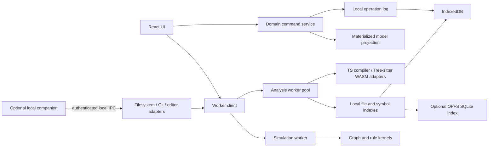

# Architecture Lab — Unbounded Local-First Expansion Specification

**Status:** product and technical design proposal  
**Scope:** an extensible, local-first engineering workbench for architecture modeling, static analysis, scenario simulation, and change planning.  
**Compatibility baseline:** the Architecture Lab requirements document; Vite, React, and TypeScript for the initial client.

## 1. Executive Vision and Extended Architectural Philosophy

Architecture Lab is a private engineering flight simulator. It connects repository evidence to a changeable architecture model, lets engineers rehearse behavior and failure, and turns the resulting decisions into implementation work. This expansion keeps that product definition and extends it toward large repositories, richer graph analysis, deterministic simulation, optional local intelligence, and deep integration with local development tools.

The governing constraint is **local execution**. Repository bytes, derived indexes, graph analyses, simulation state, embeddings, and generated plans remain on the user's machine. The core product must work with networking disabled. No feature silently sends source, paths, telemetry, prompts, embeddings, or model output to a hosted service. An optional connector to a separately installed local model or editor is a loopback/local IPC integration and must be visibly configured. The product must never treat “local-first” as a synonym for “encrypted cloud sync.”

### 1.1 Product promises

For any fact shown to the user, the product should answer: what is it, where did it come from, how certain is it, which scenario contains it, and which action can change it? Observed source facts, manually declared facts, inferences, and proposals are distinct throughout storage, rendering, export, and analysis. A graph edge without evidence is not silently promoted to a fact. A simulation is a run of an explicit model, not proof that production behaves identically.

The surface remains calm while the model is deep. The overview displays a few high-value aggregates; groups collapse; function-level detail appears only when requested. The user's current question scopes the graph, flow, findings, and comparison. Large repositories are explored by bounded context, package, path, owner, or selected flow, not by rendering every symbol at once.

### 1.2 Operating modes

1. **Browser-only:** manual modeling, project bundle import/export, and analysis of user-selected files. Browser APIs do not grant arbitrary filesystem access; directory selection and persistence depend on browser support and user grants.
2. **Local companion:** an optional explicitly installed process provides efficient recursive repository scanning, Git object access, and editor navigation over an authenticated local protocol. The companion is not a cloud service and can be disabled.
3. **Desktop shell (future):** a Tauri/Electron host may provide filesystem and process capabilities behind the same narrow interfaces. The domain layer remains runtime-neutral.

All three modes share the same model, evidence semantics, analyzers, and export formats. Capability detection is explicit; unavailable functions explain the limitation and offer a supported route rather than pretending that browser sandbox restrictions do not exist.

### 1.3 Quality attributes and budgets

| Attribute | Design target | Measurement boundary |
| --- | --- | --- |
| Privacy | No required network access; no source upload | Network audit with offline startup/import/simulation |
| Responsiveness | UI input remains responsive during import and graph work | Main-thread long-task profiling on representative fixtures |
| Recovery | Edits replay from durable operations after reload | Crash/reload at command and persistence boundaries |
| Explainability | Every inferred edge has evidence and confidence | Inspect/export traceability audit |
| Scale | Bounded views over large indexes; no requirement to mount all symbols | Fixture at several hundred thousand symbol records |
| Determinism | Identical scenario, seed, engine version, and inputs reproduce results | Replay hash and timeline equality |
| Portability | Versioned JSON project bundles; migrations are explicit | Import/export round-trip across supported schema versions |

These are goals to validate in implementation, not claims that every browser or machine meets a fixed speed. Initial performance budgets should be calibrated using a recorded hardware/software fixture matrix.

## 2. Local-First Infrastructure and WASM Engine Architecture

### 2.1 Runtime topology



The domain package has no imports from React, canvas libraries, Dexie, OPFS, browser globals, or companion-specific code. Ports describe capabilities. Adapters provide browser file handles, IndexedDB, worker messaging, WASM parser modules, optional OPFS storage, and companion IPC. This boundary permits a desktop host without moving product semantics into the host.

### 2.2 Analysis pipeline

The import pipeline is staged so a useful module graph appears before expensive detail extraction:

1. **Capability and consent:** identify available input mechanism; show included roots, ignored paths, file-size ceiling, and secret exclusions. Never request permission for unrelated paths.
2. **Inventory:** normalize relative paths, classify language/config, fingerprint files, and apply ignore rules. Do not read ignored files. Exclude `.env*`, private keys, credentials, build outputs, dependencies, and VCS metadata by default; allow explicit, scoped overrides.
3. **Package map:** identify workspace/package manifests and dependency declarations. Package declarations are evidence of a declared dependency, not proof of runtime use.
4. **Parse:** select an adapter by language and syntax version. Parse each file independently with bounded memory. Parser errors become file findings and do not stop the project scan.
5. **Extract:** emit facts such as imports, exports, declarations, routes, calls, storage operations, schema patterns, and source ranges. Adapter contributions carry rule ID, version, evidence range, confidence, and limitations.
6. **Resolve:** resolve import specifiers against local files/package aliases using configured compiler settings and explicit resolution precedence. Preserve unresolved and ambiguous candidates as findings; never guess a unique target when several fit.
7. **Project graph:** merge stable identifiers, build adjacency indexes, compute incremental summaries, and retain provenance.
8. **Review and snapshot:** show counts, skipped content, confidence distribution, unresolved links, and analysis profile; user saves an immutable baseline.

Every phase supports cancellation, progress events, and checkpoints. Incremental analysis invalidates only dependent records: a file content hash change reparses that file, then re-resolves its outward references and affected package summaries. Changes to `tsconfig`, package manifests, ignore rules, or analyzer versions invalidate their defined dependency cones.

### 2.3 Browser and WASM constraints

WASM improves portability and can move CPU-heavy parsing off the UI thread; it does not remove memory limits, filesystem sandboxing, or the cost of copying data across worker boundaries. Use transferable `ArrayBuffer`s when ownership can move; otherwise stream bounded chunks. Avoid materializing every source file and every AST simultaneously. Parse one file or a small batch, emit compact records, release source buffers, and persist checkpoints.

Use the TypeScript compiler API for accurate TypeScript/JavaScript project semantics where the runtime/package can be bundled locally. Tree-sitter WASM provides incremental, multi-language syntax trees and is useful for syntax-aware structural extraction. SWC WASM may be used behind a separate adapter when its transform/parser version and compatibility behavior are pinned. These adapters do not execute imported source. Rust, Go, and Python adapters can use pinned Tree-sitter grammars and language-specific manifest/config readers; their semantic resolution is explicitly less complete until implemented. Language parity is not implied by syntax support.

The browser build bundles parser runtimes and grammars locally. It must not fetch code or grammar artifacts from a CDN at analysis time. A build manifest lists component versions, licenses, and hashes. Large optional language bundles may be lazily loaded from the installed application package, not a remote server.

### 2.4 Worker topology and resource governance

Create a small pool based on available hardware concurrency, capped to avoid memory contention. Schedule by estimated cost and priority: inventory and selected-file parsing first, visible scope summaries next, full background indexing last. Each job includes project ID, baseline ID, cancellation token, content fingerprint, analyzer profile, and engine version. Results with stale fingerprints are discarded. A worker crash is isolated and the job can resume from the last durable checkpoint.

Progress is a structured event, not log scraping:

```ts
type AnalysisProgress = {
  jobId: string;
  phase: "inventory" | "parse" | "resolve" | "analyze" | "persist" | "complete";
  completed: number;
  total?: number;
  path?: string;
  warnings: number;
  cancellable: boolean;
};
```

Use adaptive limits for source bytes per worker, AST lifetime, queue length, and retained diagnostic count. Exceeding a limit yields a clear partial-result state and offers narrower scope or higher local resource limits. Do not crash the tab to pursue completeness.

### 2.5 Local persistence tiers

IndexedDB is the default source of truth for projects, commands, scenarios, metadata, and normal-sized indexes. Dexie can simplify indexed transactions, but transactions stay behind a repository interface. OPFS plus SQLite WASM is an optional index backend for workloads where relational indexing or larger indexes justify the complexity. It is not necessary for the initial milestone. OPFS availability, quota, locking, and durability differ by browser; feature-detect and provide a fallback.

Suggested stores:

| Store | Key | Contents |
| --- | --- | --- |
| `projects` | project ID | Name, settings, schema version, active baseline/scenario |
| `baselines` | baseline ID | Immutable model metadata, source root label, analysis profile and fingerprints |
| `elements` | baseline/scenario + element ID | Materialized architecture elements |
| `relationships` | model revision + relationship ID | Typed edges and provenance |
| `operations` | project + sequence | Append-only scenario commands and inverses |
| `files` | baseline + normalized path | Hash, language, size, parser status; source bytes excluded by default |
| `symbols` | baseline + stable symbol ID | Name, kind, owning path, range, export status |
| `findings` | model revision + finding ID | Rule result, evidence, severity, disposition |
| `layouts` | scenario + view ID | Node positions, group collapse, filters, viewport |
| `embeddings` | index version + chunk ID | Optional local vectors, model identity, source reference, redaction metadata |
| `settings` | key | Global preferences and local integration grants |

Do not persist full source text in the architecture model by default. Temporary parse buffers are released after extraction. Optional local search indexes can retain chunk text only if the user enables that feature and sees storage and deletion controls. Project deletion must remove associated indexes and OPFS files through verified project-scoped handles.

### 2.6 Offline verification

An offline acceptance run starts the installed app, imports a fixture, builds indexes, creates a scenario, runs graph analysis and simulation, and exports a plan with network interfaces disabled. The app records no outbound request attempt. Diagnostics are local and user-initiated. If the application supports update checks in the future, they are an independent, disabled-by-default capability and never run as a hidden dependency of core work.

## 3. Advanced Domain Model and Expanded Taxonomy

### 3.1 Identity, evidence, and versioning

Identifiers are opaque, stable strings. Observed element identity should prefer language-aware canonical symbols plus normalized path and package identity. A rename creates an explicit identity mapping only when evidence is strong; otherwise the import diff reports removal and addition. Never use line number alone as identity.

```ts
type Id = string;
type ISODate = string;
type ModelLayer = "observed" | "declared" | "inferred" | "proposed";
type Confidence = 0 | 0.1 | 0.2 | 0.3 | 0.4 | 0.5 | 0.6 | 0.7 | 0.8 | 0.9 | 1;

interface SourceSpan {
  path: string;                 // project-relative, normalized to /
  startLine: number;
  startColumn?: number;
  endLine?: number;
  endColumn?: number;
  contentHash?: string;         // binds evidence to a scanned revision
  symbolId?: Id;
}

interface Evidence {
  id: Id;
  kind: "source-span" | "manifest-entry" | "user-note" | "analyzer-rule" | "simulation" | "git-change";
  summary: string;
  source?: SourceSpan;
  analyzer?: { id: string; version: string; ruleId: string };
  observedAt: ISODate;
  confidence: Confidence;
  limitations?: string[];
}

interface Attribution {
  layer: ModelLayer;
  evidenceIds: Id[];
  confidence?: Confidence;
  createdBy: "importer" | "user" | "rule-engine" | "scenario-command";
}

type ElementKind =
  | "workspace" | "application" | "package" | "bounded-context" | "folder" | "file"
  | "module" | "function" | "class" | "interface" | "type" | "schema" | "route"
  | "api-endpoint" | "event" | "job" | "state-store" | "cache" | "cache-key"
  | "database" | "table" | "collection" | "queue" | "browser-storage" | "worker"
  | "service" | "external-system" | "runtime-boundary" | "contract" | "unknown";

interface ArchitectureElement {
  id: Id;
  kind: ElementKind;
  name: string;
  qualifiedName?: string;
  description?: string;
  parentId?: Id;
  path?: string;
  language?: "typescript" | "javascript" | "rust" | "go" | "python" | "json" | "yaml" | "other";
  status: ModelLayer | "deprecated";
  tags: string[];
  concerns: string[];
  owner?: { team?: string; person?: string; confidence?: Confidence };
  contractIds: Id[];
  evidenceIds: Id[];
  metadata: Record<string, string | number | boolean | null | string[]>;
  attribution: Attribution;
  createdAt: ISODate;
  updatedAt: ISODate;
}

type RelationshipKind =
  | "contains" | "imports" | "exports" | "calls" | "routes-to" | "reads" | "writes"
  | "emits" | "consumes" | "invalidates" | "depends-on" | "owns" | "serializes-as"
  | "persists-to" | "syncs-with" | "authenticates" | "guards" | "retries" | "transforms";

interface ArchitectureRelationship {
  id: Id;
  fromId: Id;
  toId: Id;
  kind: RelationshipKind;
  label?: string;
  direction: "directed" | "undirected";
  status: ModelLayer;
  evidenceIds: Id[];
  confidence?: Confidence;
  attributes: Record<string, string | number | boolean | null>;
}
```

### 3.2 Contracts, flows, and state

Contracts describe observable boundaries, not implementation guesses. Fields include input/output references, errors, auth requirements, side effects, latency or freshness goals, idempotency, and versioning. Unknown properties remain unknown rather than being filled with defaults that imply guarantees.

```ts
interface Contract {
  id: Id;
  name: string;
  boundaryElementId: Id;
  inputs: { name: string; typeRef?: string; required?: boolean; classification?: "public" | "internal" | "pii" | "secret" }[];
  outputs: { name: string; typeRef?: string; classification?: "public" | "internal" | "pii" | "secret" }[];
  errors: { code: string; retryable?: boolean; description?: string }[];
  auth?: { required: boolean; principal?: string; scopes?: string[] };
  sideEffects: { relationshipId?: Id; description: string }[];
  expectations: { p95Ms?: number; freshnessMs?: number; availability?: number; rationale?: string };
  idempotency?: "required" | "supported" | "not-supported" | "unknown";
  version?: string;
  attribution: Attribution;
}

type FlowStepKind = "invoke" | "read" | "write" | "emit" | "wait" | "branch" | "retry" | "assert" | "boundary";
interface FlowStep {
  id: Id;
  kind: FlowStepKind;
  elementId?: Id;
  relationshipId?: Id;
  label: string;
  next: Id[];
  guard?: Expression;
  effects: StateEffect[];
  timeoutMs?: number;
  retry?: { attempts: number; backoff: "fixed" | "exponential"; baseMs: number; jitter: number };
  evidenceIds: Id[];
}
type Expression =
  | { op: "eq" | "neq" | "gt" | "gte" | "lt" | "lte"; left: ValueRef; right: ValueRef }
  | { op: "and" | "or"; args: Expression[] }
  | { op: "not"; arg: Expression }
  | { op: "exists"; value: ValueRef };
type ValueRef = { kind: "literal"; value: string | number | boolean | null } | { kind: "state"; path: string };
type StateEffect =
  | { op: "set"; path: string; value: ValueRef }
  | { op: "increment"; path: string; by: number }
  | { op: "append"; path: string; value: ValueRef }
  | { op: "delete"; path: string };
interface Flow {
  id: Id;
  name: string;
  trigger: string;
  entryStepId: Id;
  steps: FlowStep[];
  initialState: Record<string, string | number | boolean | null | string[]>;
  invariants: { id: Id; expression: Expression; message: string; severity: "info" | "warning" | "error" }[];
  attribution: Attribution;
}
```

The expression language is a deliberately small, serializable DSL. It is interpreted, never evaluated with `eval`, `Function`, or imported code execution. The engine rejects unknown operators, unbounded recursion, oversized values, and references outside the run's declared state.

### 3.3 Experiments and engine state

```ts
interface Experiment {
  id: Id;
  name: string;
  baseRevision: string;
  scenarioId: Id;
  hypothesis: string;
  changes: { operationId: Id; summary: string }[];
  inputs: Record<string, string | number | boolean | null>;
  seed: number;
  engineVersion: string;
  runs: SimulationRun[];
  conclusion?: string;
  createdAt: ISODate;
}
interface SimulationRun {
  id: Id;
  status: "queued" | "running" | "completed" | "failed" | "cancelled";
  currentStepId?: Id;
  tick: number;
  virtualTimeMs: number;
  state: Record<string, string | number | boolean | null | string[]>;
  events: SimulationEvent[];
  stateHash?: string;
  failure?: { code: string; message: string; stepId?: Id };
}
interface SimulationEvent {
  sequence: number;
  atMs: number;
  kind: "step-enter" | "effect" | "branch" | "injection" | "assertion" | "step-exit" | "error";
  stepId?: Id;
  summary: string;
  statePatch?: StateEffect[];
  details?: Record<string, string | number | boolean | null>;
}

interface LocalEngineStatus {
  engineId: string;
  kind: "analysis" | "simulation" | "embedding" | "git" | "editor-bridge";
  state: "unavailable" | "idle" | "starting" | "busy" | "degraded" | "stopped";
  capabilities: string[];
  version?: string;
  lastError?: { code: string; message: string; retryable: boolean };
  networkAccess: "none" | "loopback-only";
}
```

Persist schema version, engine version, analyzer profile version, and model hash with every baseline and run. Migrations are pure, deterministic transformations with a backup copy and a preview. A future schema not understood by the current app opens read-only where safe; it is never silently rewritten.

## 4. In-Browser Simulation and Chaos Injection Specification

### 4.1 Purpose and limits

Simulation lets a developer inspect consequences of a modeled flow under explicit conditions: cache hit or miss, offline period, stale value, timeout, retry, duplicate event, storage quota failure, and race ordering. It is model-based. It does not execute application code, reproduce an operating system, or establish production correctness. The timeline labels each effect as modeled and links assumptions to the flow step.

### 4.2 Deterministic event loop

Run the simulation in a dedicated worker. Represent time as an integer virtual millisecond counter; use a priority queue ordered by `(dueAtMs, sequence)` to break ties deterministically. The seeded PRNG is versioned (for example, a small xoshiro family implementation with fixed integer semantics). Do not use wall clock, `Math.random`, network timers, or locale-dependent ordering in the simulation kernel.

Algorithm outline:

1. Validate flow DAG, step references, guard syntax, limits, initial state, and injection compatibility.
2. Initialize state, queue, seed state, run header, and event sequence.
3. Schedule entry step at virtual time zero.
4. Pop next event, advance virtual time, apply active injections, and append a pre-step snapshot or reversible state patch.
5. Evaluate step guard using the safe expression interpreter. Record branch decision and evidence inputs.
6. Apply the declared effect atomically. If a fault is injected, apply its modeled failure behavior (error, delay, dropped write, duplicate delivery, quota rejection) and take the configured edge.
7. Evaluate invariants after the transition. Record failures without mutating the flow to conceal them.
8. Schedule successor steps and retries using deterministic backoff and seeded jitter. Enforce step, queue, event, and virtual-time ceilings.
9. Stop when no events remain, a terminal assertion fails under stop-on-error, user cancels, or a limit is reached.
10. Produce an event log, state diffs, final hash, and reproducibility header.

All state mutation is represented as a patch with an inverse where possible. Time-travel moves a cursor across events and replays patches from the nearest periodic checkpoint. The checkpoint interval is configurable and derived from event count, not wall time. If an inverse is unavailable, rebuild from the previous checkpoint; do not invent an inverse.

### 4.3 Failure injection model

```ts
type Injection =
  | { id: Id; kind: "latency"; targetId: Id; startMs: number; endMs: number; minMs: number; maxMs: number; seedOffset: number }
  | { id: Id; kind: "partition"; targetId: Id; startMs: number; endMs: number; direction: "both" | "read" | "write" }
  | { id: Id; kind: "cache-stampede"; keyPattern: string; concurrentReaders: number; ttlExpiryMs: number }
  | { id: Id; kind: "cache-stale"; keyPattern: string; staleWindowMs: number; revalidateFails: boolean }
  | { id: Id; kind: "quota"; targetId: Id; capacityBytes: number; usedBytes: number; rejectAtBytes: number }
  | { id: Id; kind: "race-order"; eventIds: Id[]; permutationSeed: number }
  | { id: Id; kind: "duplicate-delivery"; targetId: Id; copies: number; spacingMs: number }
  | { id: Id; kind: "drop-operation"; targetId: Id; operation: "read" | "write" | "invalidate" | "emit" };
```

Injection windows are half-open `[startMs, endMs)`. An injection applies only when its target and operation match. Conflicting injections have a stable priority order documented in the run header. Every injection is an experiment input and appears in the timeline. Unsupported targets fail validation before execution.

Specific semantics:

- **Partition/latency:** affects modeled relationship traversal only. Latency schedules a later completion. Partition produces the edge's configured unavailable outcome; it does not alter unrelated edges.
- **Cache stampede:** schedules N concurrent miss attempts against a shared expiry. Optional single-flight behavior collapses requests only if the modeled cache contract says it does. A stampede is not presumed simply because a cache exists.
- **Stale-while-revalidate:** the model needs fresh-until, stale-until, and fallback policy. The injection can fail revalidation and reveal whether a stale value is served, rejected, or left undefined.
- **IndexedDB quota:** rejects a modeled write once projected bytes exceed the selected threshold. It does not claim to know browser quota; the threshold is an explicit scenario assumption.
- **Race ordering:** permutes only the listed simultaneously eligible events using a seeded deterministic ordering. It cannot reorder events with causal dependencies.
- **Duplicate delivery:** repeats a delivery to exercise idempotency behavior. It never automatically deduplicates.
- **Dropped invalidation:** leaves existing cache state untouched and exposes subsequent reads according to TTL and consistency policy.

### 4.4 Example event timeline

For an offline draft synchronization model: at `t=0` the user edits a draft; at `t=4` an IndexedDB write commits; at `t=100` network becomes unavailable; at `t=250` sync is attempted and queued; at `t=600` connectivity returns; at `t=610` the queue submits version 7; at `t=680` server reports version 8; at `t=681` the configured conflict policy branches into merge, overwrite, or manual resolution. If quota injection rejects the local write at `t=4`, later sync must not report the edit as durable. Each timestamp is virtual and derived from modeled delays.

### 4.5 Replay and debugging UI

Timeline controls include play/pause, step, next branch, previous assertion failure, speed control (presentation only), and jump to event. The scrubber shows state snapshots, patch diffs, pending queue, active injections, and the assumption/evidence panel. Speed changes never affect virtual time or result hashes. Re-run preserves engine version and seed; editing model inputs creates a new run. Export includes the flow revision, assumptions, injection configuration, engine version, seed, and summarized events.

### 4.6 Safety limits

Set explicit defaults, for example 100,000 events, 10,000 steps per path, bounded queue depth, bounded state bytes, and a configured maximum virtual duration. These are guardrails against accidental runaway models and are visible in advanced settings. Cancellation is cooperative at each event boundary. Malformed or adversarial imported flow bundles are schema-validated and resource-limited.

## 5. Local AI and Semantic Graph Search Architecture

### 5.1 Optional local intelligence

Core architecture modeling and deterministic analysis cannot depend on an LLM, embeddings, GPU, or companion. Local intelligence is an optional accelerator for semantic search, draft ADRs, finding explanations, and scenario suggestions. It never changes observed facts directly. Suggestions are proposals with model identity, prompt template version, input scope, and evidence links; a user must accept each change into a scenario.

Supported deployment adapters may include an in-browser model runtime with WebGPU when compatible, or an explicitly configured local Ollama/llama.cpp endpoint bound to loopback. Local inference is not automatically private if the endpoint is misconfigured or shared. Validate hostname/address as loopback, show the exact model and selected context, and make a test request only after configuration. No hosted fallback, telemetry, model download, or remote endpoint is permitted by this specification.

### 5.2 Local semantic index

Index pipeline: tokenize source or metadata locally; select bounded chunks around declarations and documentation; redact secrets and excluded paths before embedding; compute embeddings with a pinned local model; persist vector, model hash, dimensions, chunk hash, source location, and redaction version. Search combines lexical BM25-like scoring, symbol/path matching, vector similarity, graph proximity, and user filters. Results cite paths and spans, not copied source by default.

SQLite WASM with a locally packaged vector extension or a local PGlite-WASM deployment may be evaluated for vector storage; IndexedDB object stores with approximate nearest-neighbor indexes are also valid. Choose one implementation based on browser support and measured index size. These are alternatives behind `VectorIndexPort`, not simultaneous mandatory dependencies. Store embedding model files locally and document disk and memory cost. Index version includes tokenizer, chunker, embedding model digest, dimensions, and normalization method. A change requires a rebuild or explicitly compatible migration.

Vector similarity is not evidence of a code dependency. It ranks possible relevant material only. Structural graph facts remain parser/analyzer-derived. Search result UI distinguishes lexical, semantic, and graph-based ranking signals.

### 5.3 Local LLM request envelope

```ts
interface LocalGenerationRequest {
  requestId: Id;
  model: { provider: "webgpu" | "ollama-loopback" | "llama-cpp-loopback"; name: string; digest?: string };
  purpose: "adr-draft" | "finding-explanation" | "scenario-ideas" | "search-rerank";
  projectId: Id;
  scenarioId?: Id;
  contextRefs: { elementId?: Id; evidenceId?: Id; path?: string; span?: SourceSpan }[];
  userPrompt: string;
  redactionProfile: string;
  maxInputTokens: number;
  maxOutputTokens: number;
}
```

Before generation, display the selected context scope and whether source snippets, identifiers, or model summaries will be included. Default to names, graph neighborhoods, and user notes; include source excerpts only when the user enables source context. Do not include secrets, `.env` values, private key material, or unreviewed excluded paths. Persist request metadata locally, with a deletion option; do not persist raw prompt context unless the user chooses to retain it.

### 5.4 ADR drafting and anomaly detection

ADR drafting produces title, status, context, decision, alternatives, consequences, risks, assumptions, and links to model evidence. The generator must identify unsupported claims and attach “needs confirmation” annotations. User editing and acceptance are required.

Anomaly detection starts with deterministic rules: new dependency cycle, orphaned public contract, writes without modeled invalidation, duplicate state ownership, path crossing a declared boundary, flow without an error path, and change touching a restricted element. Optional local ML can rank findings, cluster similar modules, or suggest likely bounded contexts. Every score is advisory and explainable by the supporting features. No model-generated anomaly may be presented as a verified defect.

### 5.5 Privacy and failure behavior

If the local model is unavailable, semantic search can degrade to lexical and graph search; ADR drafting remains a manual template. If WebGPU lacks features or memory, expose a clear unavailable status. Never silently call an external API. Local model output is untrusted input: validate structure, escape rendered content, limit size, and reject commands or code execution. A model cannot invoke filesystem, Git, editor, or network tools through its generated text.

## 6. Visual Canvas and Rendering Engine Specifications

### 6.1 Layered views

The canvas presents a hierarchy of semantic layers: system context → application/package → bounded context → feature/module → file/function → selected syntax/contract detail. “Memory layout” is only shown if a language/runtime-specific analyzer can ground it; it is not a generic zoom layer inferred from syntax. Zoom changes detail and aggregation, not model identity. Breadcrumbs and the scope selector make the current projection explicit.

Views are projections over the model. A system map groups by runtime boundary; dependency view shows selected edge classes; flow view lays out a path; ownership view groups by owner; change-impact view shows touched and reachable elements. A saved view stores filters, layout, collapsed groups, and selected scenario, never duplicate architecture truth.

### 6.2 Scale strategy

Do not render 10,000 detailed nodes and their labels as DOM elements by default. At low zoom, aggregate packages into cluster nodes and summarize edge bundles. Expand a cluster on demand. Use level of detail: canvas-drawn compact glyphs at broad scale; labels only above a zoom threshold; full controls only for selected nodes. Virtualize inspector lists and repository trees. Use a WebGL/WebGPU renderer only after interaction and profiling show the current Canvas/XYFlow adapter is insufficient. Keep rendering behind a `GraphViewportPort` so the model and layout do not depend on the renderer.

Incremental layout preserves pinned positions and only places new or affected nodes. Dagre or ELK can be used for directed flow/module layouts; force-directed layouts should be bounded and seeded, and never rearrange a user's saved manual layout without consent. Large graphs use clustering and neighborhood extraction before layout. Edge bundling is a view-only aggregate; selecting a bundle reveals constituent relationships.

### 6.3 Interaction and accessibility

- Pan with primary drag on empty canvas; select nodes with click; multi-select with platform modifier; marquee selection is optional and keyboard accessible.
- `Cmd/Ctrl+K` opens commands; `/` focuses scoped search; `Esc` closes transient UI or clears selection; arrows move focus through visible graph adjacency; Enter opens the inspector.
- Provide a synchronized outline/tree representation for keyboard and screen-reader navigation. Canvas colors are never the sole status encoding; use labels, shapes, and patterns.
- Group selection supports add-to-scope, collapse, assign bounded context, create flow, and export focused plan.
- Edge creation validates source/target type where the relationship kind requires it; arbitrary relationships remain possible with an explicit custom type.

### 6.4 Visual language

Use semantic, stable encoding: observed (solid border), declared (small user marker), inferred (dotted border plus confidence), proposed (accent outline), and deprecated (muted with label). Concerns such as security or caching are overlays, not a replacement for provenance. Selection, focus, and health states have distinct accessible indicators. Keep background chrome quiet and reserve saturated color for actions, active path, and actionable findings.

### 6.5 Performance observability

Measure graph projection time, layout time, visible node count, edge count, frame duration, and input delay locally. Expose a developer diagnostics panel that can be explicitly opened. Do not transmit performance metrics. If frame budget is exceeded, progressively hide labels and collapse groups before dropping interaction fidelity.

## 7. Local IPC and Local Git Integration Protocol

### 7.1 Companion boundary

The local companion is optional and offers only narrow RPC methods: choose/import a directory, stream inventory and file bytes for selected paths, read Git metadata/content, resolve/open editor locations, and report capabilities. It does not accept arbitrary shell commands. No remote bind address is supported. Default listener is loopback; an ephemeral port and one-time random capability token are used. The app and companion authenticate the session; origin checks, token rotation, request size limits, and strict method allowlists apply. Show active connection state and provide an immediate disconnect/revoke control.

```ts
interface LocalBridgeHandshake {
  protocol: "architecture-lab.local/1";
  appNonce: string;
  companionNonce: string;
  capabilities: ("filesystem-read" | "git-read" | "editor-open")[];
}
interface BridgeRequest {
  id: string;
  method: "repo.select" | "repo.inventory" | "repo.readBatch" | "git.refs" | "git.diff" | "editor.open";
  params: unknown;
}
interface BridgeResponse {
  id: string;
  ok: boolean;
  result?: unknown;
  error?: { code: string; message: string; retryable: boolean };
}
```

Validate all paths against the granted project root after canonicalization; reject traversal, symlink escapes, device paths, and unexpected absolute paths. `readBatch` accepts a bounded list of normalized relative paths and returns per-file status; it does not stream an entire disk by default. The companion reads source but never executes it. Avoid logging source payloads, auth tokens, or sensitive paths.

### 7.2 Editor navigation

`editor.open` takes a path, line, and optional column. A user-configured allowlist identifies editor applications/protocols. The bridge constructs links through a fixed adapter rather than passing arbitrary URI schemes. If no bridge is installed, copy a normalized path/line reference or show a local file link where browser security permits. Bidirectional “current selection” synchronization requires explicit enablement and has no automatic source monitoring beyond requested actions.

### 7.3 Git architecture drift

Git analysis is read-only. It can inspect refs, commit metadata, trees, and diffs locally using a library such as isomorphic-git in supported browser-accessible repositories or through the companion. No fetch, push, checkout, reset, branch creation, or working-tree modification is part of this integration. The user chooses refs/commits and the app compares normalized model snapshots or re-runs analysis on selected trees.

Compare results classify added/removed/changed elements and relationships, confidence changes, moved paths, and findings whose evidence no longer resolves. Commit identity and analysis profile are stored with the comparison. Shallow/missing objects are reported as unavailable; no network recovery is attempted. Large trees are streamed and hashed incrementally.

### 7.4 OPFS coordination

SQLite WASM may use OPFS with a worker-owned connection. Centralize writes through one database worker or a documented locking mode; do not open competing writers casually across tabs. Use transaction boundaries around index generations and publish a new generation only after consistency checks pass. On quota or lock failure, preserve the prior index and offer rebuild or IndexedDB fallback. Deleting a project removes only files whose ownership manifest matches that project ID.

## 8. Comprehensive Catalog of Innovative Local-First Features

The following catalog expands the product without requiring network services. Each feature is optional in the product roadmap and must maintain provenance, local data handling, and graceful degradation.

1. **Dependency-cycle lens:** incremental SCC detection with a path explaining each cycle and the imports that form it.
2. **Architectural centrality map:** PageRank-like centrality over selected edge classes to identify high-impact modules; score is labeled as a graph metric, not a quality judgment.
3. **Bounded-context suggestions:** local community clustering proposes groups with cohesion/coupling evidence; user confirms the boundaries.
4. **Boundary rule editor:** declare forbidden dependency directions and evaluate them against observed or proposed edges.
5. **Import drift review:** compare a new local scan to a baseline and accept/reject changes in reviewable groups.
6. **Flow-from-evidence assistant:** suggest a candidate flow from route, call, read, write, and event traces without claiming dynamic execution evidence.
7. **Cache consistency rehearsal:** model cache fill, TTL, stale windows, tag invalidation, and failed invalidation across read/write flows.
8. **Offline-sync drill:** rehearse queue persistence, reconnection, retries, auth expiry, conflict, and idempotency policies.
9. **Failure matrix generator:** enumerate configured failure modes by dependency and show uncovered branches in modeled flows.
10. **Deterministic race explorer:** enumerate bounded event orderings for explicitly concurrent steps using reproducible seeds.
11. **State ownership map:** surface multiple stores claiming the same domain entity and link to their reads/writes.
12. **Data lineage trace:** follow a value from request input through validation, transformation, persistence, cache, and response where adapters provide evidence.
13. **Contract compatibility diff:** compare schema/DTO versions and identify breaking field, nullability, or error changes.
14. **Migration rehearsal:** model expand/backfill/dual-write/cutover/contract phases with rollback conditions.
15. **Rollout guardrail planner:** attach observable local checklist items and staged rollout assumptions to a change plan; it does not connect to production telemetry.
16. **Architecture fitness functions:** run project-local rules such as maximum dependency depth or no UI-to-database edge.
17. **Finding suppression with expiry:** record why a finding is accepted, scope it to a rule and model revision, and optionally set review date.
18. **Risk propagation map:** rank changed elements by reachability, criticality, ownership, and evidence confidence with formula disclosure.
19. **Scenario branching and merge:** branch proposals from one baseline and selectively compare/merge model operations with conflict review.
20. **Decision freshness review:** identify ADRs whose linked elements or assumptions changed since the decision was recorded.
21. **Local semantic search:** find related code and decisions using on-device vectors combined with lexical and graph search.
22. **Searchable analyzer recipes:** enable/disable local rules per project and preview the evidence each rule will inspect.
23. **Secret-aware export:** scan model metadata and snippets for secret-like content and redact according to a local policy before writing files.
24. **Architecture bundle signing:** optionally hash and locally sign a project bundle to detect accidental modification when moved between machines.
25. **Reproducible project capsule:** package model, analyzer profile, and fixture inputs while excluding source unless explicitly included.
26. **Local review mode:** generate a read-only review bundle with comments anchored to stable element IDs and evidence spans.
27. **Editor jump queue:** collect selected source locations and open them through a configured local editor bridge.
28. **Monorepo blast-radius view:** compute dependent packages and build/test ownership paths for a selected module.
29. **Public API surface inventory:** identify exported symbols and compare them across selected local Git commits.
30. **Runtime boundary map:** distinguish browser, worker, server, database, cache, and external provider edges from source and declarations.
31. **Storage quota rehearsal:** model estimated serialized bytes, eviction assumptions, and quota rejection paths for browser persistence.
32. **Event contract catalog:** connect emitters, consumers, retry policy, ordering assumptions, and duplicate-delivery behavior.
33. **Ownership gap report:** find unowned packages or contracts and let users assign provisional owners without claiming source evidence.
34. **Architecture change scorecard:** display touched files, affected flows, changed contracts, unresolved findings, and open assumptions per scenario.
35. **Refactoring drills:** guided local exercises with a synthetic model for cache decoupling, modularization, event migration, and offline sync; no real project modifications.
36. **Teaching playback:** replay a scenario with narrative annotations and checkpoints that explain why a branch was taken.
37. **Diff-to-plan conversion:** turn a scenario operation log into a file-area checklist, test matrix, migration order, and rollback questions.
38. **Evidence freshness monitor:** mark findings and relationships stale when the backing file hash changes.
39. **Architecture snapshots in Git metadata:** export a compact model bundle that a user may manually commit; no Git writes happen without explicit user action outside the app.
40. **Local policy packs:** import versioned rule bundles from local files, inspect every rule, and run them without downloading remote policy.

### 8.1 Graph algorithm definitions

**Strongly connected components:** run Tarjan's algorithm on a directed subgraph filtered by relationship kinds and scope. Complexity is `O(V + E)`. Return component members, internal edges, and one representative cycle path. Do not treat a component with weak inferred edges as equivalent to a confirmed cycle; show edge provenance and confidence.

**Centrality:** compute PageRank on a selected graph with damping factor `d`, normalized outgoing weights, and bounded iterations until tolerance or max iteration count. Isolated nodes retain a defined baseline score. Report parameters and graph filter alongside results. Centrality identifies structural influence under that graph model, not importance or code quality.

**Communities:** provide deterministic alternatives such as label propagation with seeded tie breaking or modularity-based methods over a selected weighted graph. Clustering is exploratory and can be unstable under parameter changes; store algorithm/version/parameters and allow manual boundary correction. Avoid forcing a single cluster taxonomy on the user.

## 9. Extended Blueprint and Implementation Roadmap

### M1 — Manual local architecture lab

Deliver project switching, manual elements/relationships, calm canvas, repository tree, flow editor/player, baseline plus scenario branches, inspector, undo/redo, IndexedDB persistence, bundle import/export, and Markdown plans. Establish schema versioning, evidence types, local network audit, and accessibility path from keyboard to primary workflows. No AI, OPFS, or companion is required.

**Exit evidence:** user can model a cache change and offline flow; reload restores work; exported plan includes assumptions and implementation/test questions; offline acceptance run succeeds.

### M2 — Repository-grounded TypeScript and Next.js analysis

Add user-selected directory input or companion interface, file inventory, TypeScript module graph, Next.js route conventions, evidence spans, per-file errors, incremental fingerprints, baseline capture, and reviewable re-import diff. Add cancel/resume, ignore profiles, secret exclusions, and analyzer provenance.

**Exit evidence:** fixture import never executes code or reads secret values; every extracted edge links to evidence; ambiguous resolution remains ambiguous; re-import preserves manual metadata where identity is stable.

### M3 — Cross-language and stack analyzers

Add Rust, Go, and Python structural adapters; package/workspace relationships; Mongoose, Redis, RTK/RTK Query, IndexedDB, and browser storage rules. Add relationship-specific confidence, analyzer configuration, findings lifecycle, SCC detection, impact traversal, and context clustering previews.

**Exit evidence:** unsupported syntax degrades to clear findings; rules are disableable; no framework-specific analyzer invents runtime behavior from naming alone; graph algorithms return explainable paths and parameters.

### M4 — Deterministic simulation and scenario comparison

Implement worker-based safe flow interpreter, explicit state transitions, cache/offline/failure semantics, seeded scheduling, timeline checkpoints, replay hashes, comparison reports, and generated test matrices. Add resource budgets and malformed-bundle hardening.

**Exit evidence:** same input/seed/engine yields same event log; fault injection affects only modeled edges; simulation labels assumptions and never executes imported project code.

### M5 — Local search, Git, and editor bridge

Add local vector index behind a port, lexical/graph hybrid search, optional local model adapters, local Git comparison, and authenticated companion protocol for filesystem/Git/editor operations. Offer WebGPU only as an optional capability. Add deletion, revocation, and local connection status flows.

**Exit evidence:** semantic search works without a network connection; local model unavailable falls back cleanly; bridge rejects unauthorized paths and arbitrary commands; Git integration performs no remote or mutating operation.

### M6 — Scale, drills, and mature local operations

Profile large monorepos, add progressive graph aggregation, optional WebGL/WebGPU renderer, OPFS SQLite backend if benchmarks justify it, project-scoped policy packs, guided drills, signed capsules, and large-scale import recovery. Finalize migration, backup, restore, and local diagnostics.

**Exit evidence:** performance profile documents tested machine/browser limits; project deletion removes all owned local data; data portability and schema migrations are tested; no network is required for core workflows.

### 9.1 Capability gates

| Capability | Browser baseline | Local companion / desktop | Optional compute |
| --- | --- | --- | --- |
| Manual modeling and simulation | Yes | Yes | None |
| User-selected file analysis | Yes, supported browser APIs | Yes | Worker/WASM |
| Recursive arbitrary repo scan | Browser-dependent and permission-bound | Yes | Worker/WASM |
| Git object comparison | Limited to accessible local data | Yes | CPU/disk |
| Editor navigation | Link/copy fallback | Yes | None |
| Vector search | Yes, index size dependent | Yes | Local embedding runtime |
| Local generation | WebGPU dependent | Local endpoint optional | Local model/GPU/CPU |

## 10. Complete Examples and Change Plan Templates

### 10.1 Example: cache-aside product detail

Model the browser route, server page, `getProduct` function, cache repository, Redis key, Mongoose collection, DTO contract, update handler, and invalidation relationship. The read flow has explicit hit, miss, database failure, cache-fill failure, and product-absent branches. The update flow marks the durable database write before invalidation; failure policy states whether the response reports success, retries invalidation, emits an outbox event, or risks stale reads. Do not infer a negative-cache policy unless declared.

Suggested invariants:

- A successful update must not return before the selected consistency policy is satisfied.
- Cache entries carry a DTO/version identity.
- Cache outage does not silently transform a stale value into a confirmed current value.
- Invalidation keys are derived by one modeled key function and covered by tests.

Compare direct invalidation, tag invalidation, and outbox-driven invalidation by required components, failure modes, recovery path, and migration cost. The scorecard shows evidence counts and assumptions separately from estimated effort.

### 10.2 Example: offline draft synchronization

Elements include editor state, IndexedDB draft record, local sync queue, connectivity state, API mutation contract, server version, and conflict resolver. Declare queue ordering, maximum size, tombstone/deletion rules, authentication expiry behavior, backoff, idempotency key, and merge ownership. Simulate quota rejection, duplicate submission, reconnect with stale server version, and permanent auth failure. Each branch ends in an explicit user-visible outcome or an unresolved policy finding.

### 10.3 Example: cache failure injection matrix

| Run | Injection | Expected modeled observation | Review question |
| --- | --- | --- | --- |
| A | Cache miss | Database read then cache fill | Is serialization stable? |
| B | Redis unavailable on read | Configured database fallback or explicit failure | Is fallback latency acceptable? |
| C | Invalidation dropped | Stale result until TTL or other repair | Is this consistency window allowed? |
| D | Concurrent expiry | N reads or single-flight collapse | Is stampede control modeled? |
| E | Cache fill write fails | Read response plus degraded cache status | Does failure alter correctness? |
| F | DTO version changes | Old entry rejected or migrated | What is key-version policy? |

The “expected observation” is the model's configured result. It is not a claim about deployed infrastructure unless tied to validated implementation evidence.

### 10.4 Change plan template

```md
# Change plan: <scenario name>

## Goal
<User-visible or operational outcome and its measure.>

## Baseline and scope
- Baseline revision: <id, import time, analyzer profile>
- Included bounded contexts / flows: <list>
- Excluded scope: <list and reason>

## Proposed architecture
<Describe changed elements and typed relationships. Label modeled proposals.>

## Evidence and confidence
<List source paths, contracts, and observed facts; separate inferences and assumptions.>

## Change areas
| Area | Existing responsibility | Proposed change | Evidence | Owner |
| --- | --- | --- | --- | --- |

## Contracts and state
<Inputs, outputs, errors, ownership, persistence, freshness, idempotency.>

## Failure and migration plan
<Ordering, retries, backfill, dual write, cutover, rollback trigger.>

## Validation matrix
| Case | Setup | Expected behavior | Automated test / manual check |
| --- | --- | --- | --- |

## Risks, decisions, and open questions
<Ranked findings with rationale and links; include accepted risks and review date.>

## Rollout and rollback
<Stages, guardrails available to the implementer, stop conditions, recovery steps.>

## Simulation record
- Engine/version/seed: <values>
- Assumptions and injections: <list>
- Result hash: <hash>
- Limitations: <model-specific caveats>
```

### 10.5 ADR template

```md
# ADR <number>: <decision title>

- Status: proposed | accepted | superseded
- Date: <ISO date>
- Scenario: <scenario id and revision>
- Linked elements: <stable IDs and names>

## Context
<Observed constraints with evidence links; label assumptions.>

## Decision
<Chosen option and boundary of the decision.>

## Alternatives considered
<Options and the reasons they were rejected or deferred.>

## Consequences
<Positive, negative, operational, migration, and security consequences.>

## Validation
<Tests, simulation runs, measurements, and what each does not prove.>

## Revisit when
<Concrete event, threshold, or date that should reopen the decision.>
```

### 10.6 Example TypeScript analyzer finding

```ts
interface Finding {
  id: Id;
  ruleId: string;
  title: string;
  severity: "info" | "low" | "medium" | "high" | "critical";
  status: "open" | "accepted" | "resolved" | "stale";
  elementIds: Id[];
  relationshipIds: Id[];
  evidenceIds: Id[];
  explanation: string;
  confidence: Confidence;
  suggestedActions: { label: string; operation?: unknown }[];
  disposition?: { reason: string; actor: "user"; at: ISODate; reviewAt?: ISODate };
}
```

Example rule: “A declared architecture boundary forbids UI modules from importing persistence adapters.” The analyzer identifies matching import relationships, lists source spans and boundary declaration, and reports each violation with confidence based on resolution quality. It offers a scenario action to add an adapter interface or revise the boundary; it does not modify source files.

### 10.7 Export and retention rules

Markdown and JSON exports include schema version, project/scenario identity, provenance labels, and generated-at time. Exported evidence paths are project-relative. Source snippets are omitted by default. A redaction preview runs before export if notes or optional indexed excerpts are included. Bundles can contain model data, layouts, flows, decisions, findings, and optionally analyzer metadata; they do not embed source repositories or model weights by default. Import validates sizes, schema, IDs, references, and expression limits before writing any project data.

## Decision Register

The following decisions are intentionally deferred until benchmarks or product validation justify them:

1. Whether the local companion is required for M2 or browser directory handles are sufficient for early users.
2. Whether OPFS SQLite materially outperforms IndexedDB for the target index size and recovery model.
3. Which in-browser renderer meets accessibility and scale needs without increasing maintenance cost.
4. Which local embedding models fit acceptable disk/memory budgets across supported machines.
5. Whether community detection should ship as one algorithm or a small set of explainable alternatives.

Each decision should be recorded as an ADR after measuring representative repositories and validating the intended workflow. Until then, implementation should preserve adapter boundaries and avoid hardwiring deferred choices into the domain model.

## Acceptance Checklist for This Specification

- Core architecture workflows have no cloud dependency.
- Imported source is never executed by analyzers, search, or simulation.
- Every observed/inferred/proposed fact carries provenance and uncertainty.
- Graph scores disclose selected edges, parameters, and limitations.
- Simulations are deterministic, bounded, replayable, and visibly model-based.
- Local AI is optional, scoped, redacted, and incapable of silently mutating the model.
- Local IPC is loopback-only, authenticated, allowlisted, and path-scoped.
- Git integration is read-only and never fetches missing objects.
- Storage backends are replaceable; deletion and recovery are project-scoped.
- Large views use grouping, level of detail, and explicit scope.
- Plans and ADRs distinguish source evidence from proposed architecture and assumptions.
